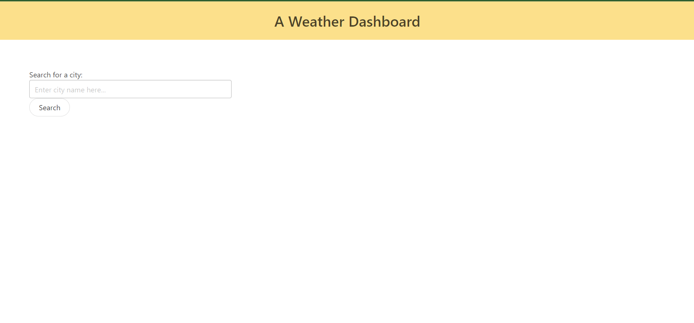

# Weather Dashboard - Challenge 6

# Description
This challenge was indeed a challenge for me. Our task was to create a weather dashboard so that a user might be able to search for weather information for a given city and also see that city's five day forecast. The brief stated that we were to make use of server side APIs to capture weather data, render it on our page, and reflect the recent searches in a bar to the side. I unfortunately failed to organize my work effectively enough to complete the task fully. I intend to seek more help and guidance this week and use all of the resources at my disposal to improve my work. Thank you for your understanding, improvements to come.

# LIVE LINK
[LIVE LINK](https://tyleresselman.github.io/weather-dashboard-ch-6/)

# Screenshot

# Credits

I collaborated with Joseph Ruiz and Jordan Harris on the logic and pseudo-code of this challenge.
